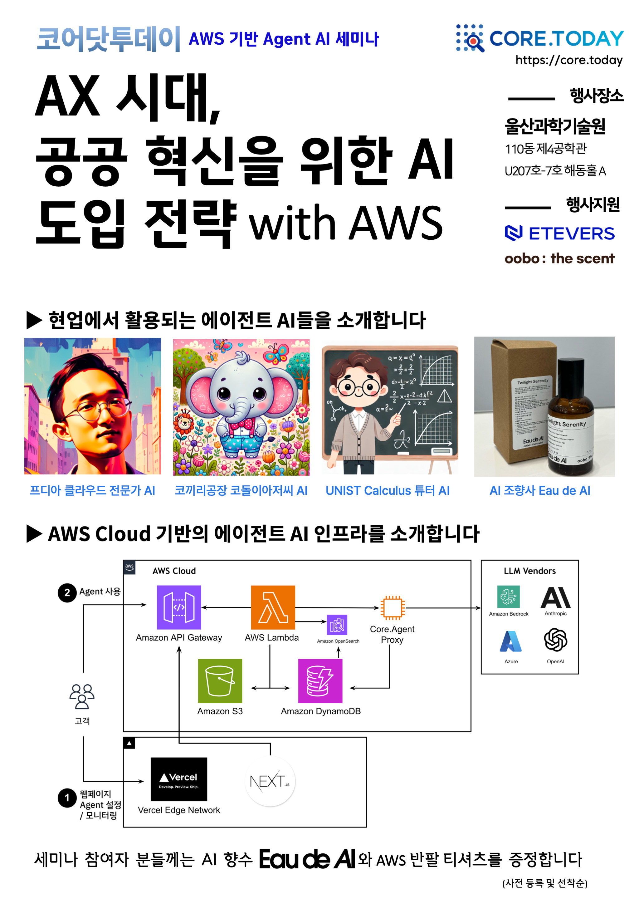

### AX시대, 코어닷투데이가 준비한 특별한 세션에 여러분을 초대합니다.

최근 급격히 발전하는 에이전트 인공지능(Agent AI) 기술은 우리의 상상을 초월하는 혁신적인 가능성을 열어주고 있습니다. 특히, Agent AI는 텍스트, 이미지, 시계열 등 다양한 데이터 분야에서 인간과 유사한 창조력을 발휘하며 큰 성과를 거두고 있습니다. 이번 세미나에서는 기업 및 공공기관의 AWS 기반 Agent AI 도입 과정에서 얻은 귀중한 인사이트를 공유합니다.

본 세미나는 공공기관에서의 AI 트랜스포메이션(AX)을 중심으로, 빠르게 발전하는 Agent AI 기술들을 효과적으로 활용하는 전략을 다룹니다. 또한, Agent AI의 위험과 제약 사항을 분석하고 이를 극복하기 위한 방안을 제시합니다. 세미나에 참석하여 AWS 기반 Agent AI의 미래를 선도할 기술적 혁신과 사회적 대응 방안에 대해 논의하고, 유익한 통찰을 얻을 기회를 놓치지 마세요.

-   행사일시 : 2024년 08월 30일 (금요일) 14:00 - 17:00
-   행사장소 : UNIST(울산과학기술원) 110동 제4공학관 U207호-7호 해동홀 A

### 행사 내용

#### ▶ 오프닝

다가온 넥스트 노멀의 시대, 인간과 AI의 협업을 어떻게 현장에 도입할 것인가? ( 코어닷투데이 김경훈 )

#### ▶ AI 도입 방법론

Chldo AI : 에이전트 AI의 AWS 기반 클라우드 AI 도입 방법 ( 코어닷투데이 김경훈 )
Break

#### ▶ AWS 전문가의 클라우드 기반 세션

GPU / HPC on AWS ( AWS )

#### ▶ AI 도입 사례 1

사회적기업 코끼리공장의 AI 키오스크 코끼리아저씨 에이전트 도입 ( 코끼리공장 이채진 대표 )
Break

#### ▶ AI 도입 사례 2

대학수학에서의 AI 튜터 도입 ( UNIST 김필원 교수 응용수학 소모임 팀 )

#### ▶ AI 도입 사례 3

더현대 대구 : AI 조향사 하이센트의 향기로운 여정 ( 코어닷투데이 안국문 팀장 )
세미나 참여자 분들께는 AI 향수 Eau de AI와 AWS 반팔 티셔츠를 증정합니다. (사전 등록 및 선착순 증정)

### 찾아오시는 길

KTX 울산역(통도사)에서 337번 버스를 이용하여 UNIST에서 하차하거나 327, 807번 버스를 이용하여 유니스트 입구에서 하차합니다.(택시 이용 시: 약 5분)

-   UNIST 오는 길 : https://unist-kor.unist.ac.kr/about-unist/directions/road/
-   네이버 지도 : https://naver.me/GxOLV12k

##### 울산과학기술원 110동 제4공학관 U207호-7호 해동홀A

110동 2층 커피숍 오른쪽 뒤편에 있습니다.

주차 시 도로 공간 및 111동 뒤편 야외 주차장 등이 하시면 됩니다. (주차권 지원)
바깥 쪽에서 출입할 경우에는 2층에서 공간이 바로 연결되어 있습니다.

## 사전등록 링크

아래 링크를 통해 사전등록해 주시는 분에 한해 AI 향수와 반팔 티셔츠를 우선적으로 제공합니다.

https://forms.gle/Ej4ZLH9nV11fMVFA8
